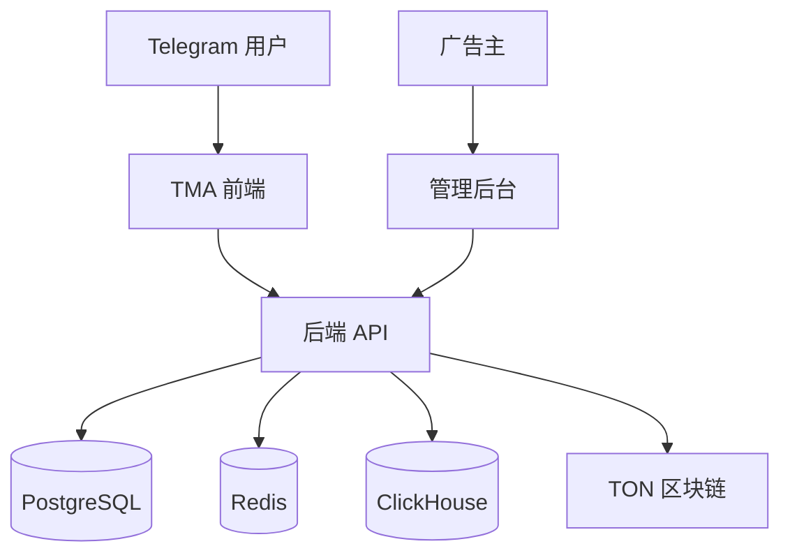

# Quest Wall 项目结构

## 目录结构

```
questwall/
├── questwall-tma/              # Telegram MiniApp 前端
│   ├── src/
│   │   ├── components/         # React 组件
│   │   ├── hooks/              # 自定义 Hooks
│   │   ├── services/           # API 服务
│   │   ├── utils/              # 工具函数
│   │   ├── assets/             # 静态资源
│   │   └── main.jsx            # 入口文件
│   ├── public/                 # 静态文件
│   ├── package.json            # 前端依赖配置
│   ├── vite.config.js          # Vite 配置
│   └── README.md               # 前端说明文档
│
├── questwall-backend/          # 后端服务
│   ├── src/
│   │   ├── auth/               # 鉴权模块
│   │   ├── quests/             # 任务模块
│   │   ├── rewards/            # 奖励模块
│   │   ├── wallet/             # 钱包模块
│   │   ├── ads/                # 广告模块
│   │   ├── risk/               # 风控模块
│   │   ├── billing/            # 计费模块
│   │   ├── app.module.ts       # 根模块
│   │   └── main.ts             # 入口文件
│   ├── test/                   # 测试文件
│   ├── package.json            # 后端依赖配置
│   └── README.md               # 后端说明文档
│
├── questwall-contracts/        # 智能合约
│   ├── jetton/                 # Jetton 合约
│   ├── nft/                    # NFT 合约
│   ├── tests/                  # 合约测试
│   └── README.md               # 合约说明文档
│
├── docker-compose.yml          # Docker 编排配置
├── questwall-api.yaml          # OpenAPI 规范
├── questwall-db-design.md      # 数据库设计文档
├── questwall-contract-design.md # 合约设计文档
├── questwall-deployment.md     # 部署文档
├── questwall-testing.md        # 测试策略文档
└── questwall-documentation.md  # 项目文档
```

## 各模块详细说明

### 1. 前端 (questwall-tma)

基于 React 和 Vite 构建的 Telegram MiniApp 应用。

**主要功能:**
- Telegram WebApp SDK 集成
- TonConnect 钱包连接
- 任务展示和交互
- 用户界面和体验优化

**技术特点:**
- 响应式设计适配移动端
- 组件化架构易于维护
- TypeScript 类型安全
- Vite 热重载开发体验

### 2. 后端 (questwall-backend)

基于 NestJS 构建的后端服务，提供 RESTful API。

**模块结构:**
- **auth**: 用户鉴权和会话管理
- **quests**: 任务创建、查询和管理
- **rewards**: 奖励发放和提现处理
- **wallet**: 钱包集成和交易处理
- **ads**: 广告网络集成和回调处理
- **risk**: 风控策略和反作弊机制
- **billing**: 计费和报表生成

**技术特点:**
- 模块化设计，职责分离
- JWT 鉴权机制
- 数据库连接池管理
- 缓存优化策略
- 日志记录和错误处理

### 3. 智能合约 (questwall-contracts)

基于 TON 区块链的智能合约。

**合约类型:**
- **Jetton 合约**: 实现代币发行和管理
- **NFT 合约**: 实现 NFT 铸造和交易

**功能特性:**
- 符合 TON 标准规范
- Gas 优化设计
- 安全性审计
- 单元测试覆盖

### 4. 基础设施

**容器化部署:**
- Docker 镜像构建
- Docker Compose 编排
- Kubernetes 部署配置

**持续集成:**
- GitHub Actions 工作流
- 自动化测试和部署
- 代码质量检查

**监控告警:**
- Prometheus 指标收集
- Grafana 可视化面板
- 日志收集和分析

## 开发环境搭建

### 系统要求
- Node.js 18+
- Docker 和 Docker Compose
- Git 版本控制
- 代码编辑器 (推荐 VS Code)

### 依赖服务
- PostgreSQL 15+
- Redis 7+
- ClickHouse 23+
- TON 区块链测试网

### 环境变量
各模块需要配置相应的环境变量，详见各模块 README 文件。

## 部署架构

### 开发环境
- 本地运行各服务
- Docker Compose 管理依赖服务
- 热重载开发模式

### 测试环境
- Docker 容器化部署
- Kubernetes 编排管理
- 自动化测试流程

### 生产环境
- 多节点集群部署
- 负载均衡和高可用
- 监控告警系统
- 自动化扩缩容

## 数据流图



## 安全架构

### 数据安全
- 敏感信息加密存储
- 数据库访问控制
- API 请求验证
- 输入数据过滤

### 网络安全
- HTTPS 加密传输
- 防火墙规则配置
- DDoS 防护
- IP 访问控制

### 应用安全
- JWT 令牌机制
- CSRF 防护
- XSS 防护
- SQL 注入防护

## 性能优化

### 前端优化
- 代码分割和懒加载
- 图片压缩和 CDN 加速
- 缓存策略优化
- 首屏加载优化

### 后端优化
- 数据库索引优化
- 查询缓存机制
- 异步任务处理
- 负载均衡配置

### 区块链优化
- Gas 费用优化
- 批量操作支持
- 状态压缩存储
- 事件监听机制

## 扩展性设计

### 水平扩展
- 微服务架构支持
- 数据库读写分离
- 缓存集群部署
- 消息队列解耦

### 功能扩展
- 插件化架构设计
- 配置化策略管理
- 开放 API 接口
- 第三方集成支持

## 监控和运维

### 指标监控
- 系统性能指标
- 业务指标监控
- 错误率和延迟
- 用户行为分析

### 日志管理
- 结构化日志记录
- 日志收集和存储
- 实时日志查询
- 异常日志告警

### 故障处理
- 自动故障检测
- 故障恢复机制
- 灾备方案设计
- 回滚策略支持